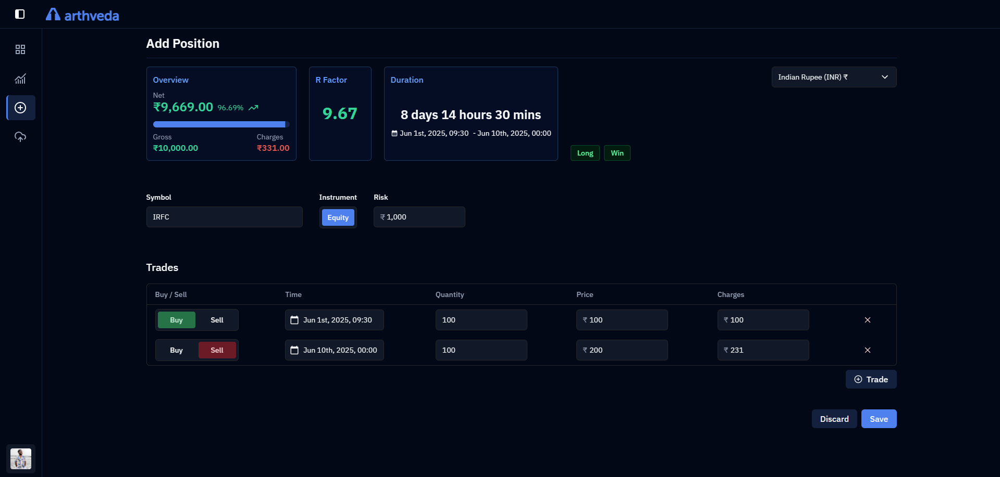

  
  <h1>arthveda</h1>
  
<strong>An open-source trading analytics dashboard that integrates with your broker to help you track, analyze, and improve your performance.</strong>

# More about Arthveda

**Arthveda is still yet to be Beta released.**

Arthveda is India first. Why? Well there are already several tools out there that support brokers like Interactive Brokers, MetaTrader, Robinhood, Charles Schwab, etc. I am from India, I use Indian brokers and I want to provide support for my fellow traders based in India that lack tools with support for Indian brokers. But if possible with the help of community and my time, we will definitely support as many brokers as we can.

**Beta release will happen soon but for the first full release, the goals are :**

-   To have a decent dashboard for analytics with filtering.
-   Be able to filter and sort your positions. Brokers like Zerodha, Groww, Upstox and mostly others as well provide no separation of different positions in the PnL statement. They end up aggregating all the trades you took for any given ticker.
-   Be able to add a position manually by using the Add Position page.
-   Be able to import historical positions from an Excel file provided by the supported brokers.
-   Be able to enable auto sync so that your positions are auto imported at the end of the day or run it manually. This feature will depend on if Brokers allow us a way to interact with their APIs.

# Screenshots

> The screenshots may be out of sync as the project is being actively developed. Last updated at 12th Jun, 2025.

### Dashboard

Here you will be getting the analytics for your positions.

### Positions

View, sort and filter your Positions.

### Import Positions

Follow the simple import wizard to import historical positions data from the supported brokers.

### Add Position

You can manually add positions too if your broker isn't supported. We aim to support as many brokers as we can but until then this screen will help you.

### Instructions to self host or run locally will be added soon.
