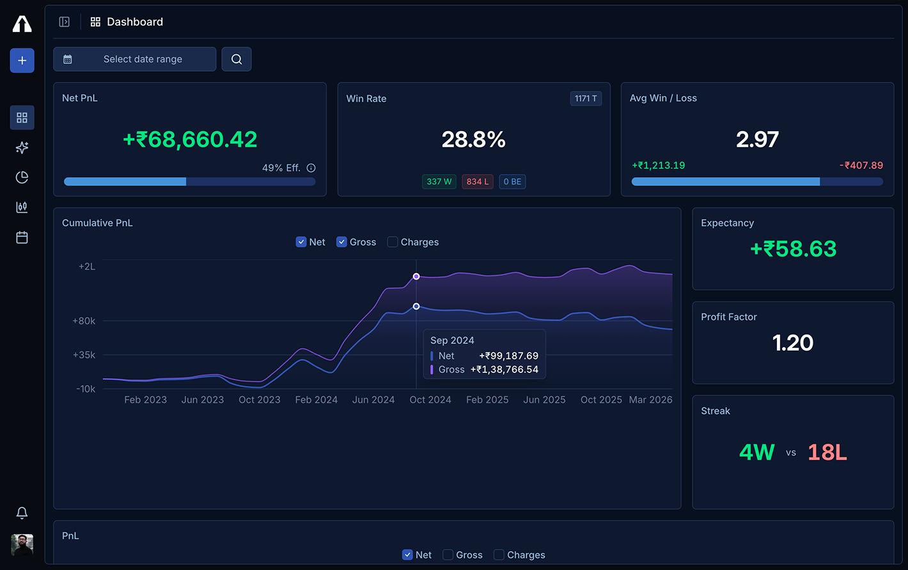

  

### Find where you're losing money in your trades — and fix it.

[Discord](https://discord.gg/RB89u64cWH) | [Website](https://arthveda.app) | [App](https://web.arthveda.app)

# Arthveda

Arthveda is a trading journal and analytics platform for Indian traders.

It shows where you're losing money in your trades, what’s working, and what to fix — so you can trade more profitably.

Works with Zerodha, Groww, Angel One and more.

Currently built for Indian traders but want to make it global.

Please help so that it can support more Indian and global brokers, prop firms, exchanges, etc.

  

## 📜 License

[AGPL v3](LICENSE) because open tools build better traders and a better ecosystem.

  Built with 💙️ by <a href="https://mudgallabs.com" target="_blank">Mudgal Labs</a>

